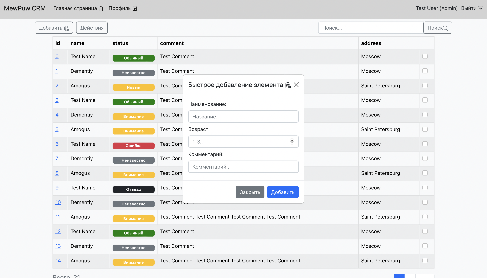

## Веб приложение база данных для анализа состояния и учета животных

### Что реализовано на данный момент:

* Авторизация с Oauth2 токеном
* Mock страница с основной таблицей, в которой будут содержать обьекты на главном экране. 

### Базовые фичи:
* Создание карточки животного и её редактирование
* Общая библиотека текущих животных с возможностью фильтрации
* Статусы, комментарии и информация по болезням
* Страница с основной информацией на сегодняшний день
* Регистрация и авторизация
* Страница сбора отзывов и пожеланий к разработчику

### Компоненты:

FastApi, Postgres (sqlite), React Js, Bootstrap
